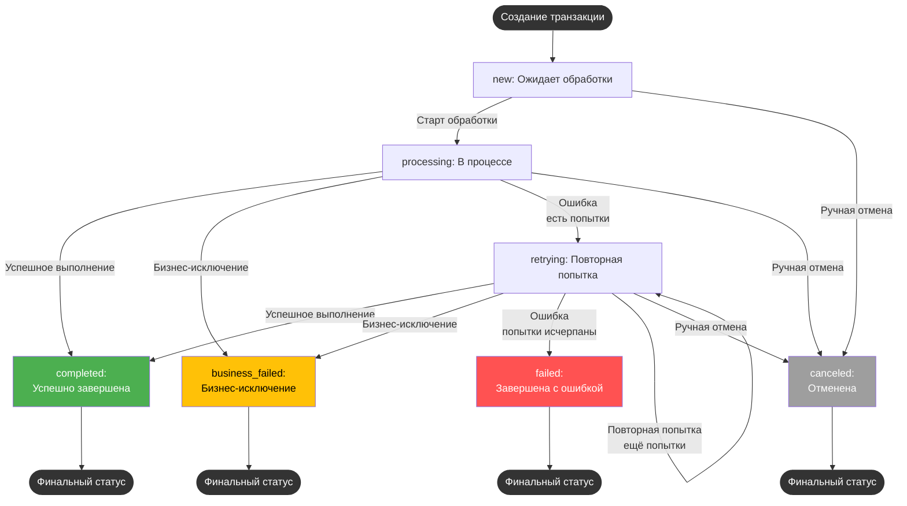

# RPA Project Template  
## Открытый шаблон проекта PIX RPA
`Версия: [3.4] — 07-08-2026`

---

### Оглавление
- [Обзор](#обзор)
- [Требуемые компоненты](#требуемые-компоненты)
- [Архитектурные роли и компоненты](#архитектурные-роли-и-компоненты)
- [Глоссарий глобальных переменных](#глоссарий-глобальных-переменных)
- [Транзакции: структура и жизненный цикл](#транзакции-структура-и-жизненный-цикл)
- [Конфигурация проекта](#конфигурация-проекта)
- [Система отчетности и placeholders писем](#система-отчетности-и-placeholders-писем)
- [Использование проекта](#использование-проекта)
- [Стандарт логирования](#стандарт-логирования)
- [Клонирование роботов](#клонирование-роботов)
- [Актуализация лимитов из PIX Master](#актуализация-лимитов-из-pix-master)
- [Поддержка](#поддержка)
- [Changelog](#changelog)

---

## Обзор

**RPA Project Template** — универсальный шаблон под PIX Studio, реализующий модульную архитектуру для автоматизированной обработки транзакций через паттерны централизации логики, контроля статусов, логирования, масштабируемых исключений и расширяемой отчётности.

---

## Требуемые компоненты

1. Восстановите зависимости проекта по `src/nuget.config` и `src/packages.config` средствами PIX Studio.
2. **Google Chrome** последней версии.
3. Диспетчер учетных данных Windows — записи с именем `Email` и иные, используемые системой.
4. Дополнительное ПО и доступы определяются конкретным проектом внедрения.
5. > ⚠️Требуется PIX Studio v3.0 и выше (версии 2.x не поддерживаются)⚠️.

---

## Архитектурные роли и компоненты

### Архитектурные роли:

| Компонент                      | Уровень         | Ключевые обязанности                                                                                  |
|--------------------------------|-----------------|-------------------------------------------------------------------------------------------------------|
| **main.pix**                   | Инфраструктура  | Инициализация, глобальная обработка ошибок, управление конфигурацией.                                 |
| **core_workflow.pix**          | Координатор     | Координация цикла транзакций: получение батчей, обработка retry, агрегация результатов, финализация.  |
| **process_transaction.pix**    | Исполнитель     | Бизнес-логика выполнения одной транзакции: атомарность, исключения, сохранение результатов.           |

#### Схема координации


#### Файловая структура (основное):
```
rpa_project_template/
├── src/
│   ├── main.pix                   # Запуск, инфраструктура
│   ├── core/
│   │   ├── core_workflow.pix      # Основной цикл
│   │   ├── core_get_transactions.pix  # Загрузка транзакций
│   │   ├── core_report_formatter.pix  # Итоговый HTML-отчет
│   └── process/
│       ├── process_transaction.pix  # Бизнес-логика транзакции
│       └── draft/
│           ├── open_card.pix (пример ошибки)
│           └── check_business_rules.pix (пример бизнес-исключения)
```
---

## Глоссарий глобальных переменных

**`global_context`** — центральный словарь для передачи состояния между компонентами.

### Пути к директориям:

| Ключ                    | Тип        | Описание                                              |
|-------------------------|------------|-------------------------------------------------------|
| `project_root`          | string     | Корневой каталог проекта                              |
| `framework_root`        | string     | Каталог RPA-фреймворка                                |
| `logs_dir`              | string     | Каталог логов                                         |
| `errors_dir`            | string     | Каталог скриншотов ошибок                             |
| `tmp_dir`               | string     | Временные файлы (очищаются при запуске)               |
| `transactions_dir`      | string     | Каталог активных транзакций                           |
| `transactions_archive_dir` | string  | Каталог архивных транзакций                           |

### Файловые и конфигурационные ресурсы:

| Ключ                        | Тип          | Описание                                            |
|-----------------------------|--------------|-----------------------------------------------------|
| `transactions_file`         | string       | Основной текущий CSV-файл транзакций                |
| `config_file`               | string       | Файл конфигурации                                   |
| `log_file`                  | string       | Файл лога текущей сессии                            |
| `work_calendar_file`        | string       | Рабочие/выходные дни                                |
| `email_error_template`      | string       | HTML-шаблон письма при ошибке                       |
| `email_report_template`     | string       | HTML-шаблон отчета                                  |

### Конфигурация и параметры выполнения:

| Ключ                             | Тип            | Описание                                                  |
|-----------------------------------|----------------|-----------------------------------------------------------|
| `config`                         | object         | Загруженная структура из `config.json`                    |
| `transactions`                   | DataTable      | Таблица всех транзакций                                   |
| `available_transaction_slots`    | int            | Свободные слоты транзакций в батче                        |
| `skip_init_next_iteration`       | bool           | Пропустить инициализацию (после бизнес-исключения)        |
| `transactions_processed`         | bool           | Все ли транзакции обработаны                              |
| `reach_error_limit`              | bool           | Достигнут лимит ошибок подряд                             |
| `errors_history`                 | List<string>   | История подряд идущих ошибок                              |
| `processed_in_run`               | HashSet<string> | Множество первичных ключей транзакций, которых коснулись в текущем прогоне. Защита от повторной обработки после BRE. Не очищается. Создаётся пустым перед while-циклом |
| `screenshot_transaction_file`    | string         | Скриншот ошибки по бизнес-исключению                      |
| `screenshot_retry_counter_{N}_file` | string      | Скриншоты по каждой попытке обработки                     |
| `selected_1c_base`               | string         | Имя базы 1С для запуска                                   |
| `maintenance_active`             | bool           | Активно ли техническое окно                               |
| `transactions_eta_status`        | string         | Расчетное ETA завершения                                  |

### Временные метки и отчетность:

| Ключ              | Тип      | Описание                                     |
|-------------------|----------|----------------------------------------------|
| `start_time`      | DateTime | Начало выполнения                            |
| `end_time`        | DateTime | Завершение                                   |
| `robot_name`      | string   | Имя робота                                   |
| `robot_status`    | string   | Текущий статус                               |
| `custom_content`  | string   | HTML-блок для отчетности, уведомлений        |

**Словарь текущей транзакции**
| Ключ                | Тип        | Описание                                |
|---------------------|------------|-----------------------------------------|
| `transaction`       | DataRow    | Данные транзакции                       |
| `transaction_index` | int        | Индекс в батче                          |
| `retry_counter`     | int        | Попытки обработки                       |

---

## Транзакции: структура и жизненный цикл

### 1. Структура транзакционной таблицы

**Технические поля (добавляются фреймворком):**

| Колонка         | Тип      | Описание                                                         |
|-----------------|----------|------------------------------------------------------------------|
| `rpa_status`    | string   | Текущий статус обработки                                         |
| `rpa_created_at`| DateTime | Дата, время создания                                             |
| `rpa_updated_at`| DateTime | Последнее обновление                                             |
| `rpa_comment`   | string   | Комментарий (ошибка/результат)                                   |
| `rpa_duration_sec`| double | Длительность обработки (сек)                                     |
| `rpa_retries`   | int      | Счетчик попыток обработки                                       |
| `rpa_screenshot`| string   | Путь до скриншота ошибки                                        |

**Пользовательские (пример):**

| Колонка | Описание                        |
|---------|---------------------------------|
| `id`    | Уникальный ID транзакции        |

### 2. Статусы транзакций

| Статус          | Описание                                             |
|-----------------|------------------------------------------------------|
| `new`           | Ожидает обработки                                    |
| `processing`    | В обработке                                          |
| `retrying`      | Повторная попытка                                    |
| `completed`     | Успешно завершена                                    |
| `failed`        | Неудача (исчерпаны попытки)                          |
| `business_failed`| Бизнес-исключение, нужна ручная доработка           |
| `canceled`      | Отменена                                             |

### 3. Жизненный цикл и переходы между статусами



---

## Конфигурация проекта

Конфигурационный файл (`config.json`) определяет все ключевые параметры:

| Параметр                                 | Описание                                              |
|------------------------------------------|-------------------------------------------------------|
| `transaction_handling.max_batch_size`    | Максимум транзакций в одном проходе                   |
| `transaction_handling.max_serial_errors` | Максимум подряд идущих ошибок (на любых транзакциях, см. «Работа с исключениями») |
| `transaction_handling.base_delay_sec`    | Экспоненциальная задержка между попытками             |
| `transaction_handling.notification.enabled/interval` | Уведомления о ходе обработки          |
| `transaction_handling.eta_calibration.enabled/history_days/min_sample_count` | Динамическая калибровка `seconds_per_transaction` из архивов |
| `maintenance`                            | Технические окна по cron-выражению, периодичность     |
| `1c_settings`                            | Массив конфигураций подключаемых 1С-баз               |
| ...                                      | Доп. специфические опции проекта                      |

**Пример инициализации путей:**
```csharp
global_context["framework_root"] = framework_root;
global_context["project_root"] = project_root;
```

---

## Система отчетности и placeholders писем

### Итоговые шаблоны (используются в HTML-письмах):

- `robot_name` — имя робота (идентификатор)
- `robot_status` — финальный итог/результат обработки
- `custom_content` — HTML-блок/таблица (например, таблица транзакций или специфичные уведомления)
- `start_time`, `end_time` — временные метки запуска/завершения
- Пути к скриншотам ошибок (например, из `rpa_screenshot` столбца или глобальных переменных)
- `transactions_eta_status` — оценка оставшегося времени

Шаблоны писем (ошибок/отчетов) должны использовать только стандартизированные placeholders — изменение общей структуры шаблонов не допускается.

### Кастомизация:

- Используется HTML-таблица с маппингом тех.статусов к человекочитаемым (через `status_map`).
- Возможно расширение для спец. уведомлений (например, вывод истории ошибок при лимите).

---

## Использование проекта

1. **Запуск:**  
   - `main.pix` инициализирует контекст, загружает компоненты, отправляет уведомление о старте.
2. **Цикл обработки:**  
   - `core_workflow.pix` перебирает транзакции, управляет retry и статусами, собирает историю ошибок и доп.снимки.
3. **Обработка транзакции:**  
   - Вызов `process_transaction.pix` с делением на этапы. Генерирует бизнес/системные ошибки в зависимости от сценария.
4. **Финализация:**  
   - `core_report_formatter.pix` строит итоговый отчет, выполняется отправка по email, архивируются транзакции.
   - После ротации вызывается `transactions_calibrate_eta.pix` — динамическая калибровка `seconds_per_transaction` из архивных данных (если `eta_calibration.enabled = true`).
5. **Работа с исключениями:**  
    - Ошибки (Exception): фиксируются, возможны ретраи до `max_serial_errors`, по превышению формируется summary.
    - Бизнес-исключения: переход в статус `business_failed`, счётчик retries сбрасывается.
    - **Семантика `max_serial_errors` (с v3.1):** Параметр ограничивает количество подряд идущих ошибок на **любых** транзакциях в одной сессии, а не retry на одной транзакции. После системной ошибки транзакция получает статус `retrying`, но не возвращается в обработку в текущем прогоне (блокируется `processed_in_run`). Счётчик `retry_counter` накапливается между разными транзакциями. При достижении `max_serial_errors` подряд (без успешных обработок между ними) робот останавливается. Транзакции со статусом `retrying` будут взяты в следующем запуске.

**Пример фиксации скриншота при бизнес-исключении:**
```csharp
screenshot_transaction_file = global_context["errors_dir"] + @$"\{Guid.NewGuid().ToString()}.png";
TakeScreenshot(screenshot_transaction_file);
transaction["rpa_screenshot"] = screenshot_transaction_file;
global_context["screenshot_transaction_file"] = screenshot_transaction_file;
```

### Стандарт логирования

При вызове `write_log.pix` (из `rpa_framework`) **текст лог-сообщения дублируется в заголовок шага** вызова. Это позволяет читать скрипт глазами: видно, что логируется на каждом шаге, без открытия параметров шага.

**Правило:**
- Шаг вызова `write_log.pix` → в поле «заголовок шага» копируется текст сообщения (значение переменной `message`), передаваемого в скрипт.
- Если сообщение — интерполированная строка (`$"...{var}..."`), в заголовок копируется шаблон целиком (с плейсхолдерами `{var}`).
- Заголовок может содержать префикс версии/даты (например `[3.2] - 05-08-2026 / ...`), если шаг добавлен или изменён в конкретной версии.

**Пример:**
```
Шаг: $"[{script_name}] Взято в работу 'transaction_index' = {transaction_index}"
  → message = $"[{script_name}] Взято в работу 'transaction_index' = {transaction_index}"
  → заголовок шага: тот же текст
```

**Альтернатива — тернарный оператор (вместо if/else-логирования):**
Если лог зависит от условия, можно использовать один шаг с тернарным оператором вместо двух отдельных `if (cond) log; else log;`. Размещается **перед** условным оператором. Применять там, где разработчик считает удобнее и лаконичнее:
```csharp
// Один шаг write_log.pix перед If-блоком:
message = authorization_successful
    ? $"[{script_name}] AUTH_GU_SUCCESS: Доступ к личному кабинету получен."
    : $"[{script_name}] AUTH_GU_NOT_SUCCESS: Не удалось получить доступ к личному кабинету. Переход к дополнительным проверкам и обработкам.";

// Следом — условный оператор с бизнес-логикой:
if (!authorization_successful) { ... }
```
Оба текста (true-ветка и false-ветка) видны в заголовке шага при чтении скрипта.

### Клонирование роботов

Шаблон поддерживает **опциональный** многоклоночный запуск на одном сервере. Каждый клон — независимая копия робота со своим `data/` (конфиг, логи, транзакции, ошибки), но общими `src/` и `docs/`. Клон определяется Windows-учёткой запустившего процесса (`Environment.UserName`).

**Управление:** переменная `clones_root` в Variables панели `main.pix`:
- **Пусто (по умолчанию)** — клонирование выключено. `project_root` берётся из выражения Variables, которое при внедрении должно заменить индикатив `PIX_RPA_PROJECT_ROOT`; один робот использует один каталог.
- **Заполнено** — клонирование включено. `project_root = clones_root\Environment.UserName`. Если каталог клона не существует — робот падает с понятным сообщением «Клон не настроен: нет каталога ...».

**Структура с клонированием:**
```
clones_root/
├── src/                    # ОБЩИЕ для всех клонов
├── docs/                   # ОБЩИЕ для всех клонов
├── <учётка_1>/data/...     # клон 1 (свой config.json, логи, транзакции)
├── <учётка_2>/data/...     # клон 2
└── <учётка_3>/data/...     # клон 3
```

`framework_root` задаётся в Variables вместо индикатива `PIX_RPA_FRAMEWORK_ROOT`, находится вне `clones_root`, является общим для сервера и не клонируется. Индикатив намеренно является невалидным C#-выражением: свежая копия не компилируется, пока внедренец не укажет реальные пути.

### Актуализация лимитов из PIX Master

Опциональный паттерн (контейнер `EnableStatus=false` по умолчанию) для централизованного управления параметрами выполнения через оркестратор. Оператор меняет значения в PIX Master → при следующем запуске робот синхронизирует локальный `config.json`.

**Что актуализируется:** `max_batch_size`, `max_serial_errors`, `max_deal_attempts` (состав параметров настраивается под проект).

**Механика:**
1. `Activities.Master.Data.GetData` × N — чтение ключей из PIX Master.
2. `ExecuteCSCode` — `Regex.Replace` × N по plain-text `config.json` → `File.WriteAllText`.

**Ключевое решение — Regex.Replace вместо JSON-сериализации:** `config.json` создаётся и поддерживается человеком. Сериализация (`JObject.Parse → ToString`) переформатировала бы весь файл, уничтожив авторские отступы и расположение. Plain-text Replace меняет только числовые значения — Git-diff показывает ровно N изменённых строк.

**Порядок в `main.pix`:** актуализация выполняется **до** `framework_loader.pix` — фреймворк читает уже актуализированный `config.json`. Работает per-clone: `config_full_path = Path.Combine(project_root, "data", "configs", "config.json")` — каждый клон синхронизирует свой конфиг.

---

## Поддержка
При проблемах или предложениях: `Aidar Bikmukhametov <ARBikmuhametov@yandex.ru>`
Сообщения об ошибках должны содержать:  
- Контекст выполнения
- Ожидаемый и фактический результат

# Changelog
<!-- ### Добавлено (Added) -->
<!-- ### Изменено (Changed) -->
<!-- ### Исправлено (Fixed) -->
<!-- ### Удалено (Removed) -->
<!-- ## [Unreleased] -->

## [3.4] — 07-08-2026
### Изменено (Changed)
- **Накопительный `rpa_duration_sec` — честное время транзакции в реестре.** Раньше `rpa_duration_sec` измерял только время последней попытки — при ретрае таймер сбрасывался в 0.0, накопленное время предыдущих попыток терялось. Теперь значение аккумулируется: при каждом завершении (успех или ошибка) к накопленному значению прибавляется время текущей попытки. Правки в `core_workflow.pix` (3 точки):
  - **Pre-processing (шаг [2.1.5]):** сброс `rpa_duration_sec = 0.0` закомментирован. Новые транзакции приходят с `0.0` из `transactions_merge.pix`, при ретрае накопленное значение сохраняется.
  - **Success path:** `rpa_duration_sec = previous_duration + rpa_timer.Elapsed.TotalSeconds` (аккумуляция через `double.TryParse` с `InvariantCulture`).
  - **Catch-блок (ошибка):** идентичная аккумуляция, накопленное время сохраняется даже при `business_failed` (честная история обработки).

## [3.3] — 06-08-2026
### Добавлено (Added)
- **Вызов `transactions_calibrate_eta.pix`** в `main.pix` (контейнеры `23ca6ef7` в try, `40fe1687` в catch). Динамическая калибровка `seconds_per_transaction` из архивных данных после ротации. Параметры в `config.json`: `eta_calibration.enabled`, `history_days`, `min_sample_count`.
- **Dump HTML-страницы при ошибке** в catch-блоке `core_workflow.pix`. При любой ошибке (системной или бизнес-исключении), если браузер открыт — сохраняется `page.html` (OuterHTML активной вкладки через `browser.GetHTML()`) в каталог `errors_dir`. URL и текст ошибки пишутся в лог, отдельный файл не создаётся. Ошибка дампа не маскирует исходную ошибку (обёрнуто в Try/Catch).

## [3.2] — 05-08-2026
### Добавлено (Added)
- **Логирование типа ошибки в catch-блоке `core_workflow.pix`** (контейнер `b522122e`).
  - При возникновении ошибки в лог записывается её реальный тип (`GetType().Name`) и признак наличия `BusinessRuleException` в тексте сообщения.
  - Цель: диагностика потери типа `BusinessRuleException` при пересечении границы `ExecuteScript` (тип съедается до `Exception`, текст подтверждает бизнесовую природу).
  - Дополняет двойную проверку `GetType().Name` + `Contains("BusinessRuleException")` в 4 условиях catch-блока.
- **Клонирование роботов** (контейнер `8a4b8f21` в `main.pix`). Опциональный паттерн многоклоночного запуска на одном сервере: каждый клон определяется Windows-учёткой (`Environment.UserName`), имеет раздельный `data/` (конфиг, логи, транзакции) при общих `src/` и `docs/`. Если `clones_root` пуст, используется настроенное при внедрении значение `project_root`; если заполнен — `project_root = clones_root\Environment.UserName`. До настройки вместо пути сохранён compile-time индикатив `PIX_RPA_PROJECT_ROOT`.
- **Актуализация лимитов из PIX Master** (контейнер `90920b76` в `main.pix`, `EnableStatus=false` по умолчанию). Синхронизация параметров выполнения (`max_batch_size`, `max_serial_errors`, `max_deal_attempts`) из оркестратора: `GetData` × 3 → `Regex.Replace` × 3 → `File.WriteAllText`. Перезапись config.json как plain-text (без JSON-ресериализации) — сохраняется авторское форматирование, Git-diff показывает ровно 3 изменённые строки. Выполняется до `framework_loader.pix` (до чтения конфига).

### Изменено (Changed)
- **Оптимизация путей вызова скриптов шаблона.** Полные пути через `Path.Combine((string)global_context["project_root"], "src", ...)` заменены на относительные от `src/`:
  - `core_workflow.pix` → `@"core\core_workflow.pix"`
  - `core_report_formatter.pix` → `@"core\core_report_formatter.pix"`
  - `core_get_transactions.pix` → `@"core\core_get_transactions.pix"`
  - `process_transaction.pix` → `@"process\process_transaction.pix"`
  - `core_error_handler.pix` → `@"core\core_error_handler.pix"`
  - Пути к скриптам фреймворка (`framework_root`) остались полными через `Path.Combine` — без изменений.
- **Замена `transactions_move_to_archive.pix` на `transactions_evict_finalized.pix`** в `main.pix`. Вызов добавлен в двух местах: в конце try-блока (позитивный сценарий) и в catch-блоке (негативный сценарий, перед `throw`). Причиной дублирования в catch является то, что `throw` в catch не даёт выполниться finally — evict должен отработать при обоих сценариях.
- **Исправление off-by-one в условии лимита ошибок** (`core_workflow.pix`, finally-блок, контейнер `e85704a1`):
  - Было: `if (retry_counter == max_serial_errors)`
  - Стало: `if (retry_counter - 1 == max_serial_errors)`
  - Счётчик по умолчанию 0, при входе в while-цикл +1 — старое условие срабатывало на одну ошибку раньше (при `max_serial_errors=2` триггер падал при 1 ошибке).
- **Usability: текст лог-сообщения в заголовке шага вызова `write_log.pix`.** Во всех шагах вызова `write_log.pix` (через `Path.Combine(framework_root, ...)`) текст лог-сообщения скопирован в поле «заголовок шага». При чтении скрипта глазами сразу видно, что логируется — без открытия параметров шага. Затронуто 19 шагов в 6 скриптах: `main.pix`, `core_workflow.pix`, `core_error_handler.pix`, `core_get_transactions.pix`, `check_business_rules.pix`.

## [3.1] — 21-07-2026
### Добавлено (Added)
- **Учёт касаний транзакций через `processed_in_run`** — защита от повторной обработки дел после `BusinessRuleException`.
  - В `core_workflow.pix` перед while-циклом инициализируется `HashSet<string>` в `global_context["processed_in_run"]` — множество номеров транзакций, которых коснулись в текущем прогоне.
  - **Регистрация касания** выполняется сразу после допуска к обработке (до try/catch с `process_transaction.pix`) — одна точка, без дублей в try + catch.
  - **Фильтр допуска** Foreach: транзакция пропускается, если её статус не `new`/`processing`/`retrying` **ИЛИ** если она уже есть в `processed_in_run`.
  - **Очистка множества не выполняется.** Это сознательное решение: дела, получившие `retrying` от `deal_finalize` (или аналога), не вернутся в текущем прогоне — они будут взяты в следующем запуске, когда список касаний создастся заново (пустым). Системная ошибка также не очищает множество — при ретрае через `while` уже обработанные дела скипаются.
  - **Первичный ключ — проект-специфичный.** В шаблоне используется `transaction["id"]` как ключ. В каждом проекте необходимо указать свой первичный ключ.
  - **Составной первичный ключ:** если ключ состоит из нескольких полей, генерируйте ключ конкатенацией:
    ```csharp
    // Пример составного ключа: "field1|field2"
    string compositeKey = transaction["field1"]?.ToString() + "|" + transaction["field2"]?.ToString();
    ((System.Collections.Generic.HashSet<string>)global_context["processed_in_run"]).Add(compositeKey);
    ```
    В фильтре допуска — аналогично:
    ```csharp
    ((System.Collections.Generic.HashSet<string>)global_context["processed_in_run"])
        .Contains(transaction["field1"]?.ToString() + "|" + transaction["field2"]?.ToString())
    ```
  - Первичный ключ задаётся в `core_get_transactions.pix` перед merge (`primary_keys = new List<string>() { "id" }`) — именно он определяет уникальность транзакции.
  - **Влияние на `max_serial_errors`:** До введения `processed_in_run` (до v3.1) `max_serial_errors` фактически считал ошибки на **одной и той же** транзакции — после ошибки транзакция получала статус `retrying` и снова допускалась к обработке в том же прогоне (через while → foreach), пока не обработается или не упрётся в лимит. С введением `processed_in_run` упавшая транзакция не возвращается в текущем прогоне — счётчик `retry_counter` не сбрасывается и накапливается **между разными транзакциями**. Таким образом `max_serial_errors` теперь означает «максимум подряд идущих ошибок на любых транзакциях в одной сессии», а не «максимум retry на одной транзакции». При достижении лимита робот останавливается, даже если каждая транзакция получила только одну попытку.

### Изменено (Changed)
- **Единый контейнер пропуска инициализации после бизнес-ошибки.** В `core_workflow.pix` добавлен контейнер (`7c035dc4`) «Пропуск инициализирующих процедур, если требуется», внутри которого размещаются все инициализационные/авторизационные шаги главного цикла. Контейнер завязан на флаг `skip_init_next_iteration` через `If`:
  - `If(!global_context.ContainsKey("skip_init_next_iteration"))` → IfTrue: инициализационные шаги.
  - После контейнера — отдельный `If(ContainsKey("skip_init_next_iteration"))` → `global_context.Remove("skip_init_next_iteration")` (точка сброса флага, одноразовый пропуск).
  - Заменяет множество однотипных `If`-обёрток вокруг каждого инициализационного контейнера.

## [3.0] — 27-04-2026
### Изменено (Changed)
- Выполнена миграция на PIX 3.0
- `README` обновлен

## [2.2.0] — 05-01-2026
### Изменено (Changed)
- Произведен рефакторинг скриптов (Частично обработка ошибки в `core_workflow.pix` вынесена в отдельный скрипт `core_error_handler.pix`)
- Изменены наименования скриптов
- Изменена структура каталогов проекта
- Проверка рабочего дня и технического окна убрана в вызов `framework_loader.pix`
### Удалено (Removed)
- Удален флаг `reach_error_limit` как избыточный

## [2.1.5] — 05-01-2026
### Добавлено (Added)
* В стандартную таблицу транзакций добавлен новый столбец `"rpa_screenshot"` для хранения пути к скриншоту ошибки, привязанного к каждой транзакции (включён в шаблон `transactions_template.csv`).
> Используйте поле `rpa_screenshot` для удобной дальнейшей диагностики ошибок прямо из итоговой отчётности и Excel-экспорта.  
### Изменено (Changed)
- Изменена сигнатура вызова скрипта `transaction_state_manager.pix`.
- Логика main_workflow.pix адаптирована для передачи только необходимых полей при обновлении состояния транзакции.

### Изменено (Changed)
* **В `report_customization.pix` реализовано отображение русскоязычных статусов транзакций в итоговой отчетности.**
    - Технические статусы транзакций (`new`, `processing`, `retrying`, `completed`, `business_failed`, `failed`, `canceled`) автоматически заменяются на читаемые формулировки.
    - Если статус вне диапазона допустимых, подставляется значение "Неизвестно".

## [2.1.4] — 23-11-2025
### Исправлено (Fixed)
* В `main_workflow.pix` устранена проблема с обработкой бизнес-исключений: ранее, если бизнес-ошибка возникала на последней попытке, это приводило к генерации финального исключения и завершению работы робота. Теперь подобные ситуации обрабатываются корректно — робот продолжает работу, если ошибка бизнесовая, даже на последней попытке.
### Добавлено (Added)
* В `get_transactions.pix` добавлено логирование загруженных транзакций в `local_transactions`. Теперь при разборе инцидентов можно отслеживать исходные данные транзакций на начальном этапе процесса.
### Удалено (Removed)
* Убраны шаги по удалению ключей `screenshot_transaction_file`, `custom_content`. Данные параметры используются в скрипте `send_report.pix` (модуль `rpa_framework`), теперь логика по удалению вынесена в общий скрипт сразу после использования (отправки SMTP)

## [2.1.3] — 15-11-2025
### Добавлено (Added)
* В основной сценарий `main_workflow.pix` добавлен механизм накопления истории ошибок: при возникновении подряд нескольких ошибок обработки (по количеству, заданному в параметре `max_serial_errors`) все сообщения об ошибках сохраняются в список `errors_history`. В случае достижения лимита ошибок в итоговое сообщение об остановке процесса теперь включается подробная история последних подряд идущих ошибок.

* Добавлен новый статус транзакции `business_failed` — "Завершена с бизнес-исключением" (нарушены бизнес-правила, не программная ошибка). Транзакции с этим статусом невозможно взять в повторную обработку, статус учитывается при итоговом анализе выполнения процесса.

### Изменено (Changed)
* Изменён порядок обработки бизнес-исключений в основном сценарии `main_workflow.pix`: теперь при возникновении бизнес-исключения транзакции присваивается статус `business_failed` вместо `completed`.

## [2.1.2] — 18-10-2025
### Изменено (Changed)

1. **Добавлен флаг для выбора базы 1С**
   - Новый параметр в глобальном контексте:
     ```
     selected_1c_base | string | Имя базы, которая будет запущена при вызове `app_launcher_1c.pix`
     ```
   - Позволяет явно выбирать нужную базу из списка, описанного в конфигурации.

2. **Рефакторинг структуры `1c_settings` в config.json**
   - Вместо одного объекта теперь используется массив баз.
   - Каждый элемент массива содержит:
     - `base_name` — уникальный идентификатор базы,
     - `base_type` — тип базы (`server`, `file`, `web`),
     - `platform_path` — путь к исполняемому файлу платформы 1С,
     - `base_path` — путь подключения к базе,
     - `credentials_key` — ключ для доступа к логину и паролю в credentials,
     - `connection_timeout` — таймаут ожидания подключения в секундах.
   - Можно описать произвольное количество баз с индивидуальными настройками.

3. **Обновлён скрипт `app_launcher_1c.pix` (модуль: `rpa_framework`)**
   - Теперь для выбранной базы автоматически используются соответствующие логин и пароль на основании `global_context["selected_1c_base"]`.
   - Корректно учитывается тип базы (формируется нужный ключ запуска — `/S`, `/F`, `/WS`).
   - Не требует ручных изменений при добавлении новых баз в конфиг.
   - Добавлено закрытие окна "Отключить использование аппаратной лицензии?"
   - Улучшено логирование и добавлен таймер при открытии 1С

### Добавлено (Added)
1. **В `rpa_framework` добавлен скрипт `transactions_eta.pix` для подсчета оставшегося времени.**
    - Позволяет в любой момент рассчитать и получить оценку оставшегося времени (ETA) до завершения обработки всех активных транзакций.
    - Формирует удобную для пользователя строку-уведомление с примерным временем окончания обработки и размещает результат в `global_context["transactions_eta_status"]`.
    - Использует значение `seconds_per_transaction` из конфигурации (`transaction_handling`).
2. В `main_workflow.pix` добавлен вызов общего скрипта `transactions_eta.pix` для подсчета оставшегося времени.

## [2.1.1] - 03-10-2025
### Добавлено (Added)
* В скрипте `main_workflow.pix` добавлена автоматическая фиксация и сохранение скриншотов интерфейса при каждом возникновении ошибки в ходе последовательных попыток обработки транзакций.  
При каждой неудачной попытке обработки транзакции формируется уникальный скриншот, путь к которому сохраняется в `global_context` с ключём вида `screenshot_retry_counter_{N}_file`.

### Изменено (Changed)
* Обработка превышения лимита последовательных ошибок (`max_serial_errors`):  
  Теперь при достижении лимита к автоматическому отчёту об ошибке прикладываются все скриншоты, сделанные на каждой неудачной попытке, для облегчения диагностики и последующего анализа инцидента (скрипт `send_error_report.pix`).

## [2.1.0] - 01-09-2025
### Добавлено (Added)
* В конфигурационный файл (`config.json`) добавлен блок `maintenance` для задания технических окон по cron-выражению. Теперь можно гибко указать периоды, в которые робот не должен работать.
  - **Проверка на старте:** Перед запуском робот проверяет, попадает ли текущее время в техническое окно. Это позволяет избежать случайных запусков в период недоступности даже при ошибках в расписании.
  - **Проверка в цикле обработки:** Во время длительной работы робот контролирует наступление технического окна и при необходимости завершает текущий цикл обработки, чтобы не нарушать регламент.
  - **Параметр `window_ahead_min`:** Позволяет задавать минимальное количество минут до начала технического окна, необходимое для запуска новой транзакции. Если до технического окна меньше указанного значения, новая обработка не запускается.

  Пример конфигурации:
  ```json
  "maintenance": {
      "_comment": "Тех. окна по одному cron-выражению. Если время попадает под любой из указанных дней/часов — робот не работает.",
      "enabled": true,
      "cron": "0 0 1-3 ? * SUN,MON,WED,FRI *",
      "_comment_cron": "С 01:00 до 03:59 каждое воскресенье, понедельник, среду и пятницу",
      "window_ahead_min": 30,
      "_comment_window_ahead_min": "Минимальное количество минут до наступления технического окна, которое должно оставаться для запуска новой транзакции. Например, если до начала тех. окна осталось меньше 30 минут, новая обработка не запускается."
  }

### Изменено (Changed)
* Логика кастомизации отчёта вынесена из основного скрипта (`main`) в отдельный скрипт — `report_customization.pix`. 
  Все операции по подготовке отчётной таблицы представлены в виде отдельного шаблонного скрипта.
  Такой подход упрощает адаптацию отчёта под требования конкретного проекта.

## [2.0.1] - 28-08-2025
### Добавлено (Added)
* В скрипте `main_workflow.pix` в словарь `global_context` добавлен флаг `skip_init_next_iteration`. Указывает, что инициализация параметров и авторизация должны быть пропущены на одну итерацию после возникновения бизнес-ошибки. Флаг автоматически удаляется перед входом в цикл транзакционной обработки.

### Изменено (Changed)
* В скрипте `main_workflow.pix` в блоке `catch` вынесена инициализация флага превышения лимита ошибок `reach_limit_error`. Его отсутствие в этом месте приводило к бесконечным циклам внутри `while` до того, как мы попадали в цикл транзакционной ошибки
  ```csharp 
  if (retry_counter == ((System.Text.Json.JsonElement)global_context["config"]).GetProperty("transaction_handling")
                                                                          .GetProperty("max_serial_errors")
                                                                          .GetInt32())
  {
    global_context["reach_error_limit"] = true; // взводим флаг для фиксации факта превышения лимита безусловно (транзакционная ошибка, либо иная)
  }
  ```

## [2.0.0] - 05-08-2025
### Исправлено (Fixed)
* Перенесена логика авторизации и получения транзакций в блок `try/catch/finally` в скрипте `main_workflow.pix`. Теперь ошибки на этапах авторизации и получения транзакций корректно обрабатываются механизмом повторов.
### Изменено (Changed)
* Изменен тип для `rpa_duration_sec` с Int32 на double
* Изменена сигнатура вызова `framework_loader\...\transaction_state_manager.pix`: убран параметр `(int) transaction_index`, сделан обязательным `(DataRow) transaction`. В связи с этим отрефакторены вызывающие скрипты.
### Добавлено (Added)
* В `config.json` добавлен ключ "ssl"
```json
"_comment_ssl": "Используется для активации/снятия флага \"Использовать SSL\" в `framework_loader\\...\\send_report.pix' и `framework_loader\\...\\send_error_report.pix'",
    "ssl": true
```
* В `main_workflow.pix` добавлена единая обработка транзакционных ошибок в блоке `try/catch/finally`.  
Предусмотрен отдельный ключ для скриншота подобной ошибки в словаре 
  ```csharp 
  global_context["screenshot_transaction_file"]
  ```
  В `finally` блоке предусмотрено удаление ключа перед потенциально новой итерацией
* В `framework_loader\...\send_report.pix` добавлена обработка нового ключа со скриншотом транзакционной ошибки
* Добавлено уведомление при запуске робота
* Добавлен скрипт для транзакционной обработки `transaction_workflow.pix`.  
  Заложенная концепция на диаграмме ниже
    ```mermaid
      flowchart LR
      A[main.pix<br>Инфраструктура] -->|Инициализация<br>фреймворка| B[main_workflow.pix<br>Координатор]
      B -->|Цикл обработки| C[transaction_workflow.pix<br>Исполнитель]
      C -->|Результат| B
      style A fill:#5e81ac,color:white
      style B fill:#88c0d0,color:black
      style C fill:#bf616a,color:white
    ```
* Добавлены псевдо-скрипты в `workflows\pseudo\...` для демонстрации концепции работы с исключениями и прерыванием скриптов.
